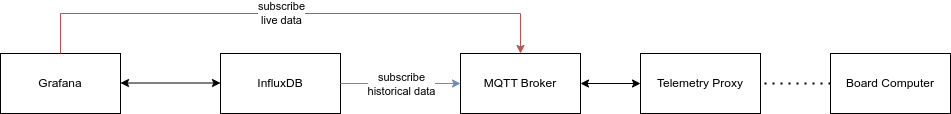

# C2
C2 is a prototype network to record and show real time telemetry data of model rocket flights.

It uses Grafana, InfluxDB and MQTT to visualize, store and exchange telemetry data. Additionally it uses a telemetry proxy to translate the received data into MQTT messages. Altough the telemetry proxy is made for a specific use case, the flexibility of MQTT allows other clients to be used too, as long as they use the correct telemetry format.

This repository contains the following modules: 
- c2-board-computer: The board computer collecting telemetry data
- c2-telemetry-proxy: The proxy translating the received data into MQTT messages
- c2-infrastructure: Docker files to set up the infrastructure